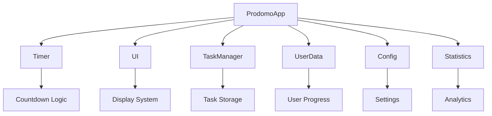
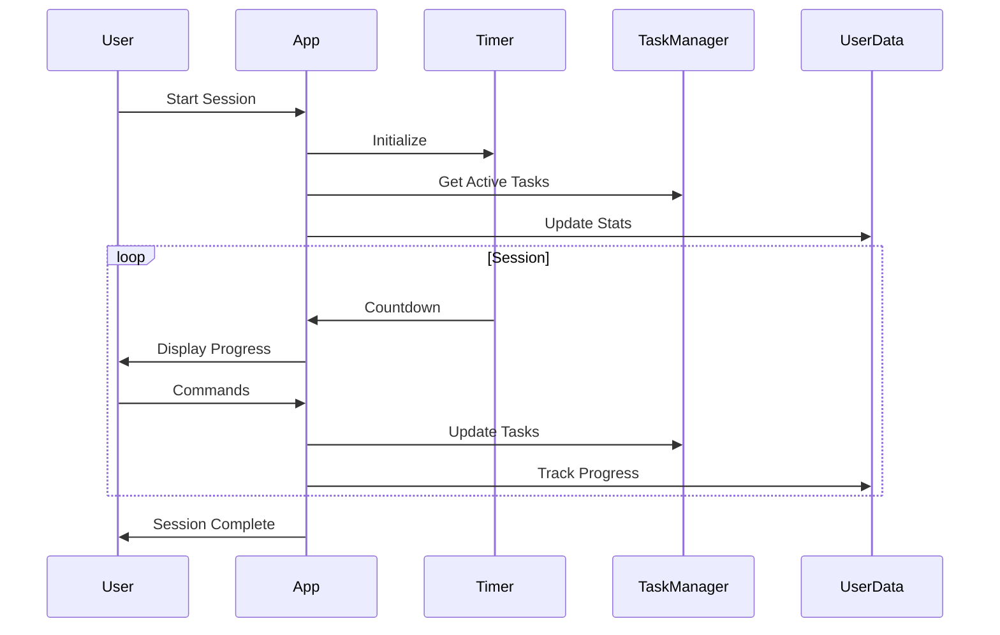
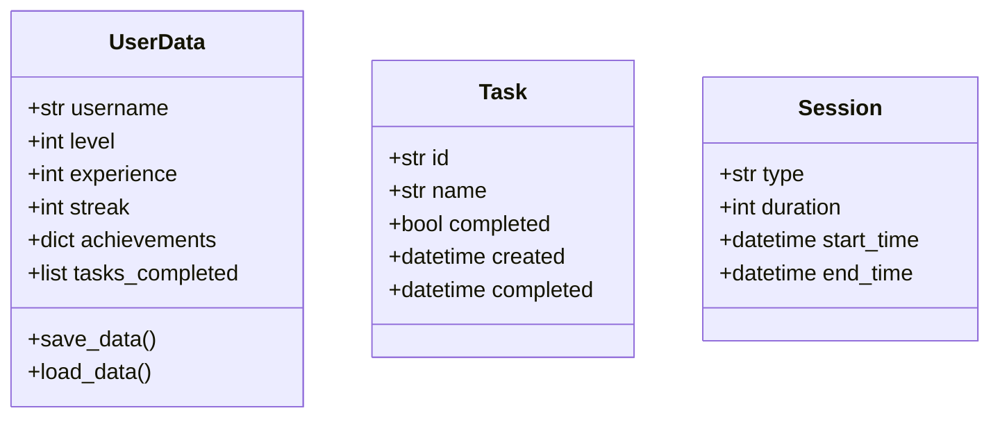
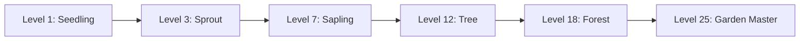

# Prodomo - The Epic Productivity Garden


A gamified Pomodoro timer application that transforms your productivity journey into an epic gardening adventure. Grow your focus, nurture your tasks, and watch your productivity garden flourish!

## 🌱 Features

- **Epic Story Progression**: Experience your productivity journey as a mystical gardening adventure
- **Achievement System**: Unlock achievements and discover their stories
- **Task Management**: Plant and nurture your tasks to completion
- **Nature-Themed Animations**: Beautiful visual feedback for your progress
- **User Statistics**: Track your growth and progress
- **Motivational Quotes**: Get inspired during your sessions
- **Leveling System**: Grow from a seedling to a mighty tree
- **Streak Tracking**: Maintain your daily gardening habit

## 🛠️ Technical Architecture

### System Components



### Data Flow



## 📦 Installation

1. Clone the repository:
```bash
git clone https://github.com/IhabProjects/prodomo.git
cd prodomo
```

2. Create and activate a virtual environment:
```bash
python -m venv venv
source venv/bin/activate  # On Windows: venv\Scripts\activate
```

3. Install dependencies:
```bash
pip install -r requirements.txt
```

## 🚀 Usage

1. Start the application:
```bash
python pomodoro.py
```

2. Enter your name to begin your gardening journey

3. Use the following commands during sessions:
- `p`: Pause session
- `r`: Resume session
- `s`: Stop session
- `t`: Show tasks
- `q`: Quit to main menu
- `h`: Show help
- `1-9`: Complete task with ID

## 🏗️ Technical Details

### Core Components

1. **ProdomoApp (pomodoro.py)**
   - Main application controller
   - Manages session flow and user interaction
   - Coordinates between all components

2. **Timer (timer.py)**
   - Handles countdown logic
   - Manages session states (work/break)
   - Provides progress updates

3. **UI (ui.py)**
   - Handles all display logic
   - Manages animations and visual feedback
   - Implements story progression display

4. **TaskManager (task.py)**
   - Manages task creation and completion
   - Stores task data
   - Provides task statistics

5. **UserData (user_data.py)**
   - Manages user progress and statistics
   - Handles data persistence
   - Tracks achievements and levels

### Data Structure



## 🔧 Configuration

The application can be configured through `config.py`:

- Work session duration
- Short break duration
- Long break duration
- Animation settings
- Display preferences

## 📊 Statistics Tracking

The application tracks:
- Total sessions completed
- Tasks completed
- Current streak
- Experience points
- Level progression
- Achievement unlocks

## 🎮 Gamification Elements

### Leveling System


### Achievement System
- First Session
- Task Master
- Focus Expert
- Early Bird
- Night Owl
- Consistency
- Productivity Guru

## 🐛 Troubleshooting

Common issues and solutions:

1. **Keyboard input not working**
   - Ensure you're using the correct terminal
   - Check if another application is capturing input
   - Try running as administrator

2. **Display issues**
   - Ensure terminal supports ANSI colors
   - Check terminal size is sufficient
   - Verify font supports emoji characters

3. **Data persistence issues**
   - Check file permissions
   - Verify JSON file integrity
   - Ensure proper file paths

## 🤝 Contributing

1. Fork the repository
2. Create a feature branch
3. Commit your changes
4. Push to the branch
5. Create a Pull Request

## 📝 License

This project is licensed under the MIT License - see the [LICENSE](LICENSE) file for details.

## 🙏 Acknowledgments

- Colorama for terminal coloring
- Pyfiglet for ASCII art
- Art for text styling
- Pydirectinput for keyboard input